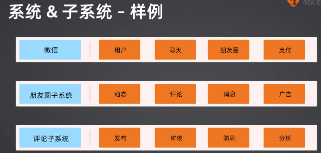

# 概念 什么是架构
- 目标
    掌握架构与的准确定义
    能够区分关联感念的区别
- [toc] 
    - 1. 系统和子系统
    - 2. 架构和框架
    - 3. 模块和组件
    - 4. 架构的定义和剖析

## 1. 系统和子系统
- **系统** - 泛指一群有关联的个体组成，更具某种规则运作，能够完成个别元件不能独立完成的工作群体。它的意思是“总体”，“整体”和“联盟”。
- **子系统** - 由一群有关联的个体系统组成，多半是更大系统的中的一部分。【符合系统的定义】
- 【关联】某种内在关系，可以让个体之间形成系统；
- 【规则】个体之间按照一定运作约束；
- 【能力】系统功能**超越**个体功能，**超出**的部分即能力；即，个体功能之和不等于系统能力；
- 【分层】自顶向下分层

例子：微信朋友圈结构

## 2. 模块与组件
- [模块(module)] 
- [组件(component)]